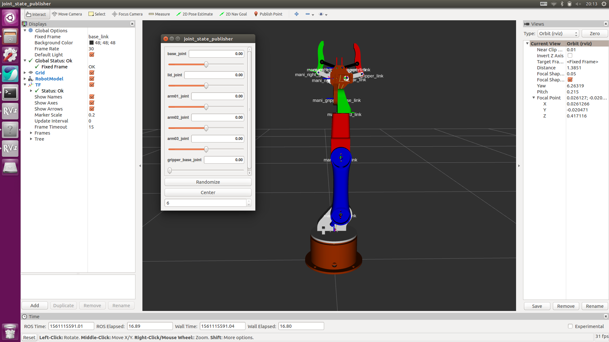

# ros_manipulator_project

### Download & Start project
~~~
$ cd catkin_ws/src
$ git clone https://github.com/eungi/ros_manipulator_project.git
$ cd ..
$ catkin_make
~~~

### Run project
~~~
$ roslaunch ros_manipulator_project mani_visual.launch
~~~

### Run serial_node
~~~
$ sudo chmod 777 /dev/ttyACM0

$ rosrun rosserial_python serial_node.py _port:=/dev/ttyACM0 _baud:=57600
~~~
